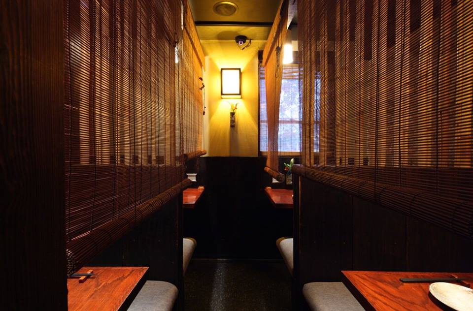

I'm borrowing from David Heinemeier Hansson here. Six years ago, he wrote [Rails is omakase](https://dhh.dk//2012/rails-is-omakase.html) to capture his notion of what makes a delicious software framework: it is heavily curated and borne of experience. I think of Vue.js the same way.

Here's an excerpt from DHH's post:

> There are lots of à la carte software environments in this world... I want this for my ORM, I want that for my template language, and let's finish it off with this routing library... It's a very popular way of consuming software. Rails is not that. Rails is omakase. A team of chefs picked out the ingredients, designed the APIs, and arranged the order of consumption on your behalf according to their idea of what would make for a tasty full-stack framework. The menu can be both personal and quirky. It isn't designed to appeal to the taste of everyone, everywhere.

I love this metaphor, because a) Rails, including all its API choices and baggage, has treated me very well throughout my career in tech, and b) I love me some agedashi tofu.

What does this have to do with Vue? I believe Vue's growing popularity is partly due to its highly selective maintainers and that the recommended ingredients, though not to everyone's taste, are well-suited to most projects, big and small.

### Enjoy a multiple-course meal

Vue articulates many courses making up the full meal for a frontend framework. These days, developers have come to expect a robust API to build components and a fast implementation built on top of a virtual dom. However, Vue.js doesn't stop there. For Vue developers, the framework and its ecosystem provide adequate if not excellent implementations of orthogonal dependencies that solve problems many non-trivial apps eventually need.

The offering includes the Vue Router, Vuex for state management, and the Vue test utils for unit testing. Through the Vue CLI, developers also get sensible defaults in webpack configuration for hot module replacement, code-splitting, tree-shaking, efficient long-term caching, while having access to pre-configured opt-ins for TypeScript, Progressive Web Apps, ESLint, and multiple test runners.

There is great comfort in knowing that the Vue team is behind these projects and they complement one another appropriately in my Vue.js applications.

### Substitutions cost little extra

So you may not agree with everything on the menu. That's fine! Many of the defaults are easily changed through configuration or add-ons. Want to use Redux? No problem! Class-style syntax? The customer is always right. Don't like mustache-style curly braces in templates? You can change it! Maybe you can't stand the fact that Vue has templates at all and would prefer to use JavaScript. Well, that's ok too; add another [Babel plugin](https://github.com/vuejs/babel-plugin-transform-vue-jsx), and you can write Vue components with JSX inside of render functions a lot like React.

As another example, let's talk about webpack. I think it is a fantastic piece of software. I've spent months learning how it works. I have given [a conference talk](https://rossta.net/talks/webpack-survival-guide-rails.html) about it. However, usually, most of us, myself included, don’t want to maintain a custom configuration from project to project when we have deadlines to meet. The Vue CLI defaults are just fine. Still need to customize? Vue provides an API to extend the base configuration while making it easier to upgrade to take advantage of framework-supported improvements. There's also nothing stopping you from ditching webpack for Parcel or Rollup or whatever other transpiler or module bundler you prefer.

### An opinionated chef

The core team consistently shows restraint in decided what features and improvements to fold into the framework. For example, much has been made of Vue's choice to avoid class syntax for components as the default, e.g. [this issue on GitHub](https://github.com/vuejs/vue/issues/2371). There are excellent reasons for this decision, one of which is for Vue to work without a build environment. As a feature, this makes Vue incredibly easy to get up-and-running, for beginners learning the framework or for seasoned developers trying out a quick prototype. "It will fail," some said. I suppose that remains to be seen, but after several years of arguing, the framework continues to thrive.

### A consistent experience for all customers

Scott Molinari made this comment on a previous post of mine:

> once the usage of the API is down pat, anyone and everyone who knows Vue is basically doing the same thing. This also means the need for best practices are held to a minimum and both of these advantages mean cognitive load over time is reduced. i.e. when you dig into someone else’s component, you understand it quickly. This all in turn means Vue code is more robust and in the end, it’s of higher quality.

This point is especially important for both beginners and experienced developers alike. One of the significant tradeoffs to cobbling libraries together is that it can be harder to transition into new projects or unfamiliar parts of a large codebase. This approach may pay off for the right teams. In most cases, those tradeoffs aren't worth it to me because I place much value on consistency.

---

When my late wife and I lived in New York City, our favorite restaurant was [Zenkichi](https://www.zenkichi.com/). The cuisine is Japanese brasserie, but the experience is so much more. If you make it to the Williamsburg neighborhood in Brooklyn, you should try it.

It's housed in a small building with a wooden exterior and no discernable markings. Located near the East River in the Williamsburg of Brooklyn, it's easy to miss from the outside.

The interior is dark, romantic, hand-crafted. Each table upstairs is like a small private dining room with a pull-down curtain and a small buzzer to summon the wait staff.

Everytime we ate there, we chose the omakase menu. We left all the decision-making up to the chef. It's difficult at first to place that kind of trust in someone else's judgment. Giving up control is uncomfortable. However, this led to some delightful discoveries. Of course, not all the courses were to our liking. Nevertheless, we loved the experience.

---

The chef’s menu need not be reserved for special occasions in web development. With Vue.js, we have a framework that gives us all the ingredients we need to jump into building outstanding user interfaces. It also makes it relatively easy to swap out menu items to suit your preferences. So it would seem you [can have your cake and eat it too](https://en.wikipedia.org/wiki/You_can%27t_have_your_cake_and_eat_it)? Just another reason why I find Vue.js so fulfilling.
